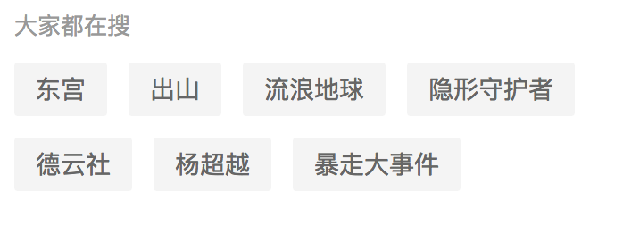

# miniprogram-suggest


## 使用效果


## 使用方法

1. 安装 suggest

```
npm install --save miniprogram-suggest
```

2. 在需要使用 suggest 的页面 page.json 中添加 suggest 自定义组件配置

```json
{
  "usingComponents": {
    "suggest": "miniprogram-suggest"
  }
}
```

3. WXML 文件中引用 suggest

``` xml
<suggest titleValue="大家都在搜" listData="{{listData}}"></suggest>
```

**datepicker的属性介绍如下：**

| 属性名                   | 类型         | 默认值                 | 说明                                                       |
|-------------------------|--------------|-----------------------|-----------------------------------------------------------|
| titleValue                   | String       | ''                    | 标题                          |
| listData                 | Array      | []                 | 数据集                                                   |
| myevent              | EventHandle  |                       | 数据集item点击事件|
